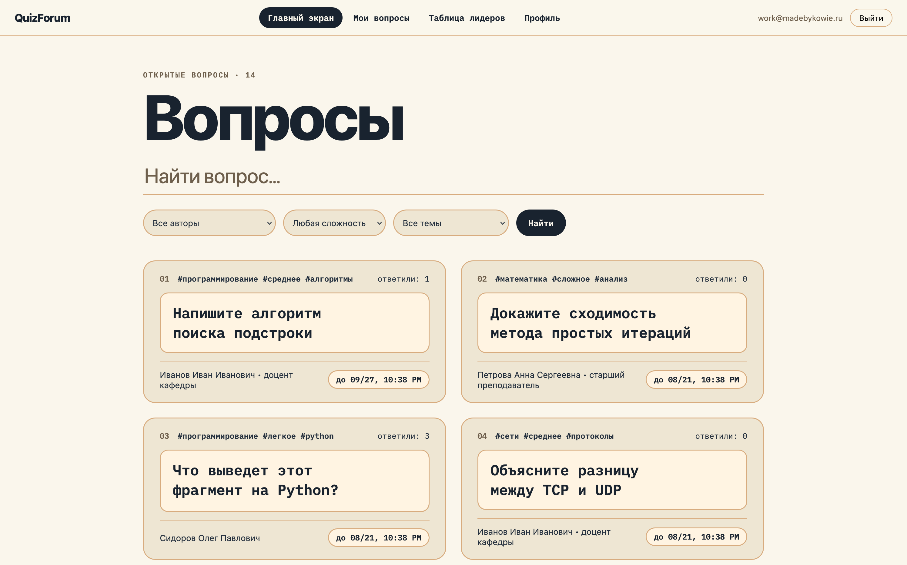
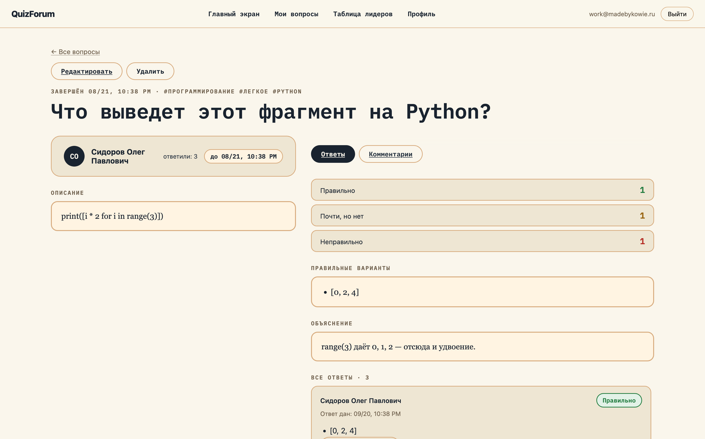
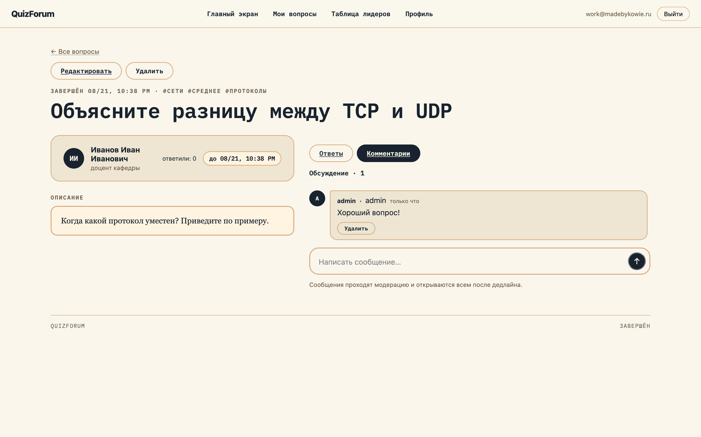
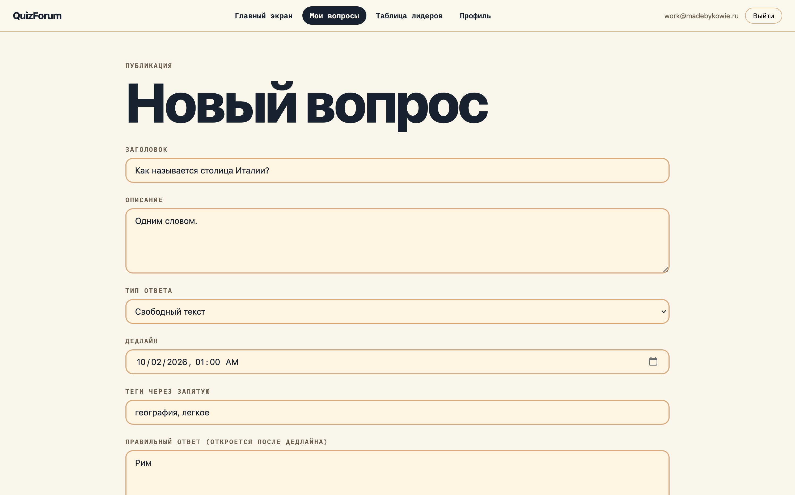
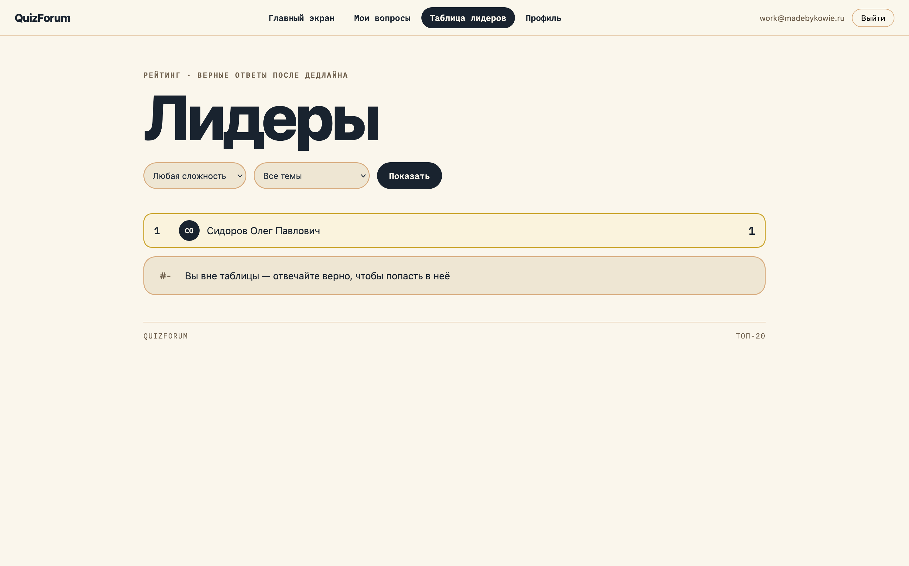

# QuizForum

Открытый банк вопросов. Любой пользователь публикует Вопрос со скрытым Эталонным ответом и Дедлайном. Остальные отвечают вслепую. После Дедлайна Вопрос раскрывается: эталонный материал, все Попытки, Вердикты, Комментарии.

## Скриншоты



<details>
<summary>Остальные экраны</summary>

| Вопрос | Комментарии |
| --- | --- |
|  |  |

| Новый вопрос | Лидерборд |
| --- | --- |
|  |  |

</details>

## Как это работает

- Автор публикует Вопрос: заголовок, текст, тип ответа, Дедлайн, теги.
- Каждый пользователь отправляет одну Попытку на Вопрос. Попытка неизменяема.
- До Дедлайна видны только личности Ответивших. Тексты и Вердикты скрыты.
- После Дедлайна (Раскрытие) всё становится публичным. Ручных действий не требуется.
- Trustee получает доступ уровня Автора к одному Вопросу до Дедлайна.

## Типы вопросов и Вердикты

Типы ответа: `text`, `code` (с языком), `single_choice`, `multiple_choice`.

Вердикты: `pending`, `correct`, `partial`, `incorrect`.

- Вопросы с выбором оцениваются сразу по правильности Вариантов. Точное совпадение — `correct`. Частично верный набор — `partial`.
- Попытки `text` и `code` уходят внешнему Жюри (модель OpenJev, отдельный инференс-сервис, не Rails-процесс). Уверенное «похоже на верный» становится `correct`, уверенное «похоже на неверный» — `incorrect`. Сомнительное или непроверенное остаётся `pending` — решение за Автором.
- Автор, Trustee и админ ставят и меняют оценку вручную в любой момент через диалог подтверждения. Рядом видна подсказка Жюри: что совпало, чего не хватило.

## Роли

- Публиковать Вопросы может любой зарегистрированный пользователь. «Преподаватель» и «студент» — персоны, не привилегии.
- Trustee — доступ к одному Вопросу, не глобальная роль.
- `display_role` — декоративная подпись («доцент кафедры»). Доступа не даёт.
- Флаг admin — только администрирование сайта.

## Вход и подтверждение почты

- Регистрация с подтверждением почты: строгий гейт — вход блокируется до подтверждения, есть повторная отправка письма.
- Пароль минимум 12 символов, без правил сложности.
- Вход через Google OAuth2. Неподтверждённые (`email_verified=false`) отклоняются. Привязка существующего аккаунта по email — только при подтверждённом адресе.

## Комментарии и Модерация

Проверка синхронная, до записи в базу. Не прошла — строка не сохраняется.

- Вопрос проверяется целиком: заголовок, текст, теги, Эталонный ответ, пояснение, тексты Вариантов. Отклонённый или непроверенный Вопрос не публикуется.
- Комментарий, прошедший проверку, публикуется сразу. Сомнительный висит в `pending` до одобрения Автором, Trustee или админом. Отклонённый или непроверенный не сохраняется — только сообщение об ошибке.
- `pending` не раскрывается автоматически после Дедлайна. Чужие неодобренные комментарии посторонним не видны никогда.
- Двойной клик по отправке комментария не создаёт дублей: повтор того же текста в течение 30 секунд ведёт на существующую запись, кнопка блокируется на время отправки.
- Вопросы, Попытки, оценки и комментарии ограничены рейтом: 10 запросов за 3 минуты. Модерируемые тексты не попадают в логи.

## Таблица лидеров

Рейтинг по числу Вердиктов `correct` на раскрытых Вопросах.

## Стек

- Ruby 4.0.7, Rails 8.1.3.1, PostgreSQL, Hotwire (Turbo + Stimulus), Importmap
- Аутентификация: сессии `bcrypt`, Google OAuth (`omniauth-google-oauth2`), подтверждение email
- Фон: Solid Cache / Queue / Cable. Ассеты: Propshaft. Деплой: Kamal, Thruster, Docker
- Sidecar (:8000): Laya (модерация, `/v1/judge`) + OpenJev 0.8B (жюри, `/v1/grade`). CPU, веса в `./weights/hf-cache`, качаются при первом старте

## Быстрый старт

```bash
bin/setup
bin/rails db:seed   # демо-банк: 3 пользователя, 7 вопросов
bin/dev             # приложение (:3000) + Laya sidecar (:8000)
```

Первый старт качает веса в `./weights` (Laya + OpenJev 0.8B) и может занять до 15 минут. `/up` отвечает, только когда обе модели загружены. Готовность видно в `log/sidecar.log`.

Тесты:

```bash
bin/rails test
bin/rails test:system
```

Линт и безопасность:

```bash
bin/rubocop
bin/brakeman
bin/bundler-audit check
```

## Конфигурация

Скопировать `.env.example` в `.env`. Нужные ключи:

| Ключ | Назначение |
| --- | --- |
| `GOOGLE_CLIENT_ID` / `GOOGLE_CLIENT_SECRET` | Вход через Google |
| `SMTP_LOGIN` / `GMAIL_APP_PASSWORD` | Письма подтверждения и сброса пароля |
| `APP_HOST` | Имя хоста в ссылках из писем |
| `LAYA_SIDECAR_URL` | Внешняя модерация; пусто = локальный sidecar из `bin/dev` |
| `JURY_SIDECAR_URL` | Внешнее жюри; по умолчанию `localhost:8000` |
| `MODERATION_OFF=1` | Только для локальной разработки без sidecar. В production игнорируется |


## Лицензия

MIT. См. `LICENSE`.
