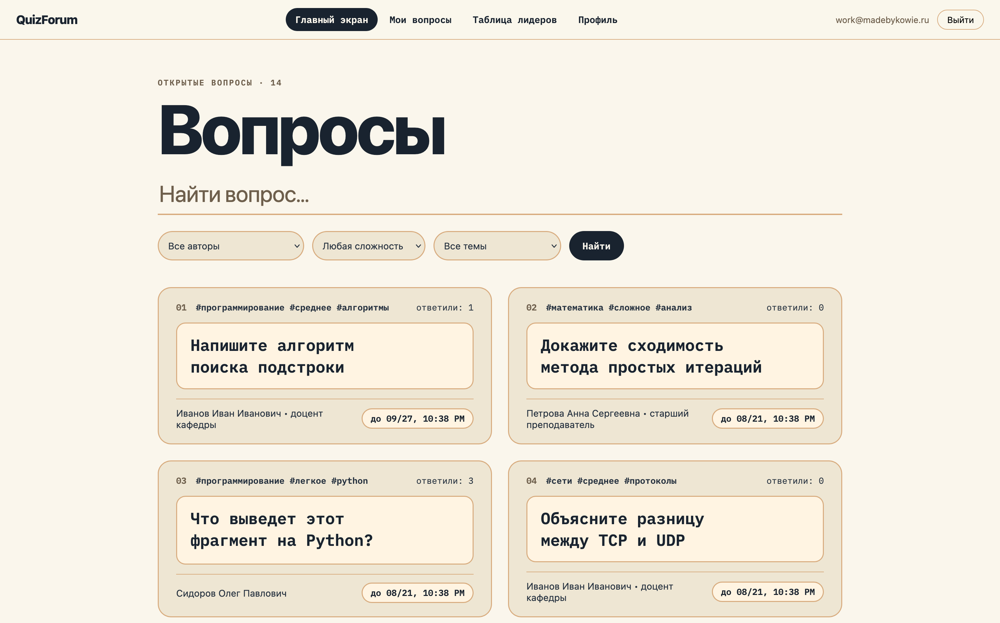
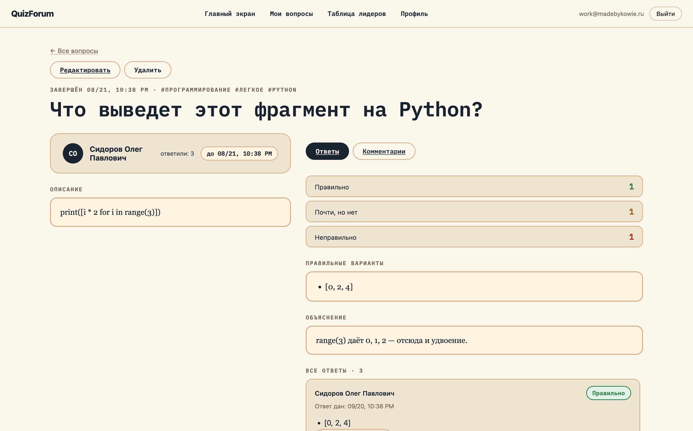
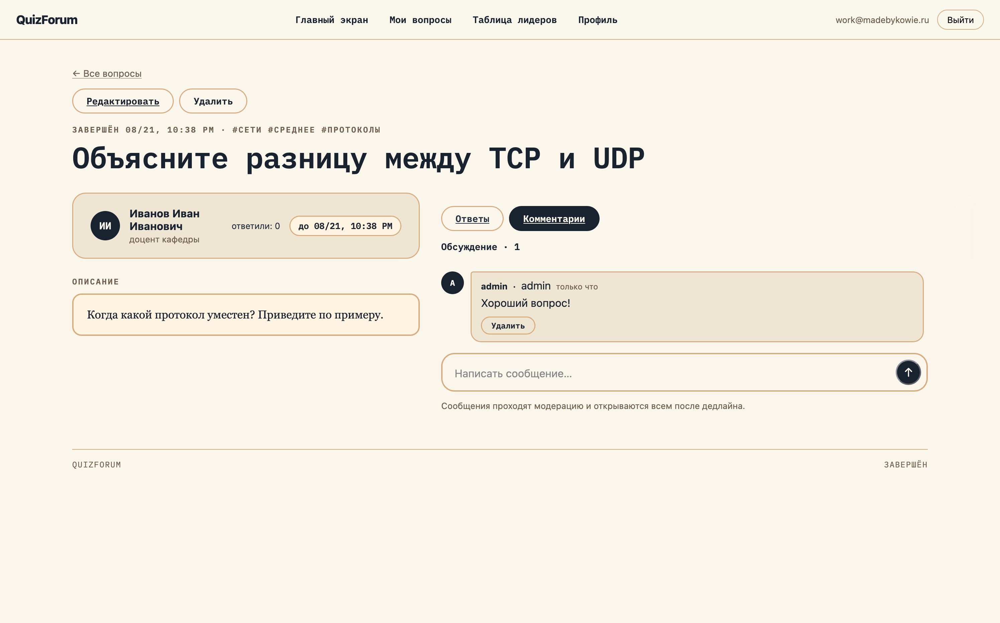
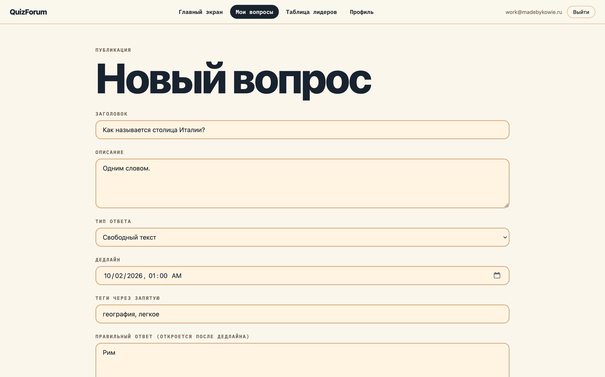
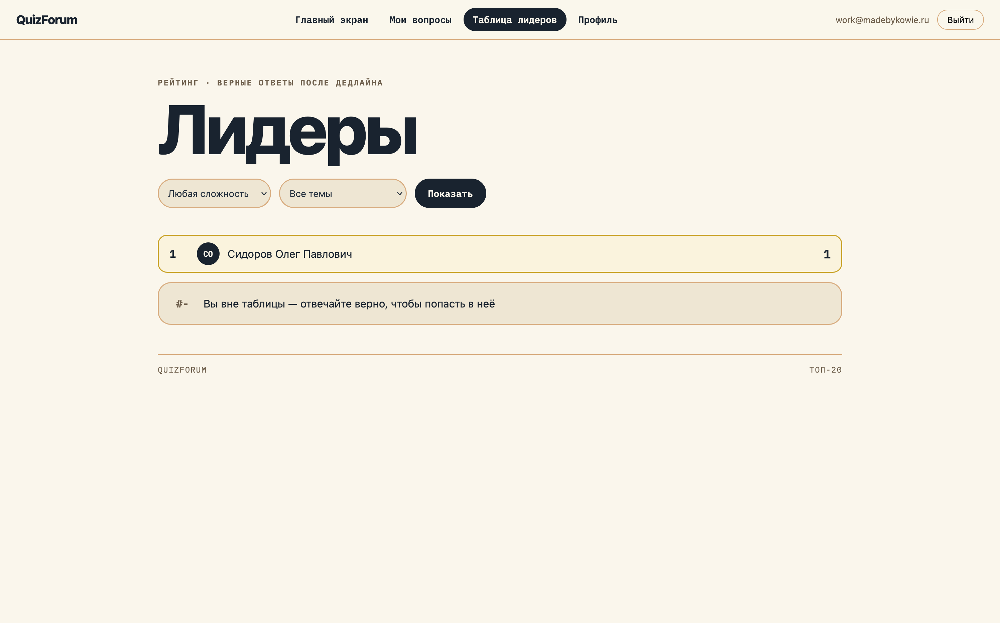

# QuizForum

Открытый банк вопросов. Любой пользователь публикует Вопрос со скрытым Эталонным ответом и Дедлайном. Остальные отвечают вслепую. После Дедлайна Вопрос раскрывается: эталонный материал, все Попытки, Вердикты, Комментарии.

## Скриншоты



<details>
<summary>Остальные экраны</summary>

| Вопрос | Комментарии |
| --- | --- |
|  |  |

| Новый вопрос | Лидерборд |
| --- | --- |
|  |  |

</details>

## Как это работает

- Автор публикует Вопрос: заголовок, текст, тип ответа, Дедлайн, теги.
- Каждый пользователь отправляет одну Попытку на Вопрос. Попытка неизменяема.
- До Дедлайна видны только личности Ответивших. Тексты и Вердикты скрыты.
- После Дедлайна (Раскрытие) всё становится публичным. Ручных действий не требуется.
- Trustee получает доступ уровня Автора к одному Вопросу до Дедлайна.

## Типы вопросов и Вердикты

Типы ответа: `text`, `code` (с языком), `single_choice`, `multiple_choice`.

Вердикты: `pending`, `correct`, `partial`, `incorrect`.

- Вопросы с выбором оцениваются сразу по правильности Вариантов. Точное совпадение — `correct`. Частично верный набор — `partial`.
- Попытки `text` уходит внешнему Жюри (модель OpenJev, отдельный инференс-сервис, не Rails-процесс). Уверенное «похоже на верный» становится `correct`, уверенное «похоже на неверный» — `incorrect`. Сомнительное или непроверенное остаётся `pending` — решение за Автором.
- Попытки `code` проверяет отдельный сервис CodeRunner. Он запускает эталонное решение Автора и код Ответившего на одних и тех же входных данных и сравнивает результаты: совпали везде — `correct`, разошлись — `incorrect` или `partial`. Поддерживаются 8 языков: Python, JavaScript, TypeScript, Ruby, Go, Java, C++ и C#.
- Автор, Trustee и админ ставят и меняют оценку вручную в любой момент через диалог подтверждения. Рядом видна подсказка Жюри: что совпало, чего не хватило.

## Роли

- Публиковать Вопросы может любой зарегистрированный пользователь. «Преподаватель» и «студент» — персоны, не привилегии.
- Trustee — доступ к одному Вопросу, не глобальная роль.
- `display_role` — декоративная подпись («доцент кафедры»). Доступа не даёт.
- Флаг admin — только администрирование сайта.

## Вход и подтверждение почты

- Регистрация с подтверждением почты: строгий гейт — вход блокируется до подтверждения, есть повторная отправка письма.
- Пароль минимум 12 символов, без правил сложности.
- Вход через Google OAuth2. Неподтверждённые (`email_verified=false`) отклоняются. Привязка существующего аккаунта по email — только при подтверждённом адресе.

## Комментарии и Модерация

Проверка синхронная, до записи в базу. Не прошла — строка не сохраняется.

- Вопрос проверяется целиком: заголовок, текст, теги, Эталонный ответ, пояснение, тексты Вариантов. Отклонённый или непроверенный Вопрос не публикуется.
- Комментарий, прошедший проверку, публикуется сразу. Сомнительный висит в `pending` до одобрения Автором, Trustee или админом. Отклонённый или непроверенный не сохраняется — только сообщение об ошибке.
- `pending` не раскрывается автоматически после Дедлайна. Чужие неодобренные комментарии посторонним не видны никогда.
- Двойной клик по отправке комментария не создаёт дублей: повтор того же текста в течение 30 секунд ведёт на существующую запись, кнопка блокируется на время отправки.
- Вопросы, Попытки, оценки и комментарии ограничены рейтом: 10 запросов за 3 минуты. Модерируемые тексты не попадают в логи.

## Таблица лидеров

Рейтинг по числу Вердиктов `correct` на раскрытых Вопросах.

## ИИ-вопросы дня

Каждый день в 17:00 появляется пак из 9 вопросов от нейросети: по 3 лёгких, средних и сложных, темы разные. Пак помечен тегом #ИИ, автор — Google Gemini.

- На главной висит баннер во всю ширину под фильтрами, он ведёт на страницу `/ai` со всеми девятью вопросами.
- Отвечать можно до 15:00 следующего дня, дальше раскрытие как у обычных вопросов. Закрытый пак держится в ленте 2 часа, потом уходит в архив. В архиве ИИ-вопросы скрыты по умолчанию, для них есть вкладка «Только ИИ».
- Через 3 дня после ухода в архив ИИ-вопросы удаляются вместе с попытками (`AI_RETENTION_DAYS`).
- Баннер скрывается в Профиле → Настройки. Настройка хранится в куке браузера на год.

Генерация идёт через Gemini (ключ `GEMINI_API_KEY`) либо через входящий вебхук `POST /api/ai_questions` с токеном `AI_INGEST_TOKEN`. Сгенерированное проходит ту же проверку, что и вопросы людей: отклонённое не публикуется. Вручную сегодняшний пак пересоздаётся командой `bin/rails ai:refresh`, пак за конкретную дату — `bin/rails "ai:regenerate[2026-10-05]"`. Полное отключение — `AI_QUESTIONS_ENABLED=0`.

## Стек

- Ruby 4.0.7, Rails 8.1.3.1, PostgreSQL, Hotwire (Turbo + Stimulus), Importmap
- Аутентификация: сессии `bcrypt`, Google OAuth (`omniauth-google-oauth2`), подтверждение email
- Фон: Solid Cache / Queue / Cable. Ассеты: Propshaft. Деплой: Kamal, Thruster, Docker
- Sidecar (:8000): Laya (модерация, `/v1/judge`) + OpenJev 0.8B (жюри, `/v1/grade`). CPU, веса в `./weights/hf-cache`, качаются при первом старте
- CodeRunner (:8001): проверка попыток `code` — гоняет эталон и код на общих тестах, сравнивает результаты

## Быстрый старт

```bash
bin/setup
bin/rails db:seed   # демо-банк: 3 пользователя, 7 вопросов
bin/dev             # приложение (:3000) + Laya sidecar (:8000) + CodeRunner (:8001)
```

Первый старт качает веса в `./weights` (Laya + OpenJev 0.8B) и может занять до 15 минут. `/up` отвечает, только когда обе модели загружены. Готовность видно в `log/sidecar.log`.

На сервер — одной командой через Docker Compose: см. [docs/DEPLOY.md](docs/DEPLOY.md).

Тесты:

```bash
bin/rails test
bin/rails test:system
```

Линт и безопасность:

```bash
bin/rubocop
bin/brakeman
bin/bundler-audit check
```

## Конфигурация

Скопировать `.env.example` в `.env`. Нужные ключи:

| Ключ | Назначение |
| --- | --- |
| `GOOGLE_CLIENT_ID` / `GOOGLE_CLIENT_SECRET` | Вход через Google |
| `SMTP_LOGIN` / `GMAIL_APP_PASSWORD` | Письма подтверждения и сброса пароля |
| `APP_HOST` | Имя хоста в ссылках из писем |
| `LAYA_SIDECAR_URL` | Внешняя модерация; пусто = локальный sidecar из `bin/dev` |
| `GEMINI_API_KEY` | Генерация ИИ-паков; пусто = только вебхук |
| `GEMINI_MODEL` / `GEMINI_FALLBACK_MODEL` | Основная и запасная модели (по умолчанию `gemini-3.5-flash-lite` и `gemma-4-31b-it`) |
| `AI_INGEST_TOKEN` | Токен входящего вебхука; пусто = приём закрыт |
| `AI_RETENTION_DAYS` | Сколько дней ИИ-вопросы живут в архиве (по умолчанию 3) |
| `AI_QUESTIONS_ENABLED=0` | Выключить ИИ целиком |
| `JURY_SIDECAR_URL` | Внешнее жюри; по умолчанию `localhost:8000` |
| `CODERUNNER_URL` | Внешняя проверка кода; пусто = локальный CodeRunner из `bin/dev` |
| `MODERATION_OFF=1` | Только для локальной разработки без sidecar. В production игнорируется |

## Лицензия

MIT. См. `LICENSE`.
